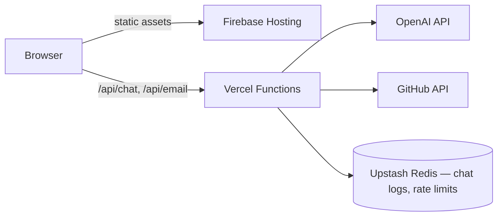

# Stephen Agyemang — Portfolio

Personal portfolio site built with **React 19** and **Vite 7** — a terminal/HUD-inspired interface with an AI chatbot that answers questions about my work using live GitHub data.

**Live:** [stephenagyemang.com](https://stephenagyemang.com)

## Features

- **Project Discovery chatbot** — streaming AI assistant that answers questions about my projects, grounded in live GitHub repo data rather than a static script
- **Email Draft Assistant** — generates a tailored outreach draft from a short prompt
- **Interactive skills graph** — force-directed, drag-enabled canvas on desktop; static grid on mobile
- **Project showcase** — per-project color theming with embedded live demo modals
- **MoNiCa.Ai demo** — self-contained walkthrough of the AI interviewer pipeline
- **Experience timeline** — roles and leadership, with a live indicator for ongoing positions
- **Credentials** — certifications, honors, and awards
- **Photo carousel** — campus and conference moments in a framed viewport
- **Dual theme** — dark/light switcher, persisted to `localStorage`
- **HUD aesthetic** — animated telemetry bar, rotating reticle frame, ambient glow layers

## Tech Stack

| Layer | Technology |
|---|---|
| Frontend | React 19, Vite 7 |
| Styling | CSS custom properties (no framework) |
| Icons | react-icons |
| Fonts | Inter + DM Mono, self-hosted via `@fontsource` |
| AI | OpenAI `gpt-5.6-luna` (streaming) |
| Backend | Vercel Serverless Functions |
| Chat logs & rate limiting | Upstash Redis (REST, dependency-free client) |
| Hosting | Firebase Hosting (static) + Vercel (API) |

## Architecture

The static site and the API live on **different hosts**. [`aiService.js`](stephen-portfolio/src/services/aiService.js) calls the Vercel functions by absolute URL, so the API works no matter who serves the frontend:



This is deliberate — Firebase Hosting serves static files only, and rewriting the serverless functions as Cloud Functions would mean putting the project on the Blaze plan for no real gain.

## Getting Started

```bash
cd stephen-portfolio
npm install
npm run dev           # http://localhost:5173
```

Vite's dev server serves the frontend only. Since `aiService.js` points at the deployed Vercel URL, **the AI features work in local dev without running a backend** — they call production. To run the functions locally instead, use `vercel dev` and repoint those fetch calls.

| Script | Purpose |
|---|---|
| `npm run dev` | Dev server with HMR |
| `npm run build` | Production build → `dist/` |
| `npm run preview` | Serve the built bundle locally |
| `npm run lint` | ESLint |

## Environment Variables

Server-side only — read by the Vercel functions, never bundled into the client. Set them in the Vercel project settings, and in `stephen-portfolio/.env.local` for local function development.

| Variable | Required | Purpose |
|---|---|---|
| `OPENAI_API_KEY` | Yes | Powers `/api/chat` and `/api/email` |
| `UPSTASH_REDIS_REST_URL` | No | Upstash Redis REST endpoint. Backs chat logging and cross-instance rate limiting. |
| `UPSTASH_REDIS_REST_TOKEN` | No | Upstash REST auth token. Without this pair both features degrade gracefully — logging no-ops and rate limiting falls back to per-instance memory. |
| `ALLOWED_ORIGINS` | No | Comma-separated CORS allowlist. Defaults to the Firebase, Vercel, and localhost origins. |
| `AI_DAILY_REQUEST_CAP` | No | Global ceiling on AI requests per UTC day across all callers. Defaults to `1000`. |

## Abuse Protection

The AI endpoints are public and unauthenticated, so they're guarded in [`api/guards.js`](stephen-portfolio/api/guards.js):

| Guard | Limit |
|---|---|
| Per-IP burst | 8/min chat, 4/min email |
| Per-IP daily | 60/day chat, 20/day email |
| Global daily cap | `AI_DAILY_REQUEST_CAP` (default 1000) |
| Input length | 500 chars chat, 600 chars email |
| Payload | Client-supplied projects clamped to 25 entries, 300 chars per field |
| Origin | Non-allowlisted origins get `403` |

Counters live in Upstash Redis keyed by a **SHA-256 hash of the IP** — raw addresses are never stored — and fall back to in-memory counting if Redis is unavailable or unconfigured, so an outage degrades the limiter instead of taking the chatbot down. Keys carry a TTL, so expiry is automatic rather than a manual cleanup chore. The global cap is the guard that actually bounds worst-case spend, since per-IP limits alone don't stop someone rotating addresses.

Rate-limited requests return `429` with a `Retry-After` header and a human-readable message that the UI shows directly.

## Deployment

Both hosts deploy automatically from `main`:

| Target | Trigger | Serves |
|---|---|---|
| Firebase Hosting | [GitHub Actions](.github/workflows/firebase-hosting.yml) | Static site at the live URL |
| Vercel | Git integration | `/api/*` serverless functions |

The Firebase workflow builds `stephen-portfolio/` and deploys to the `live` channel using a `FIREBASE_DEPLOY_SERVICE_ACCOUNT` repo secret. That account holds `firebasehosting.admin` and `firebase.viewer` and nothing else, so a leaked CI secret can only touch Hosting. Firebase is now used **only** for static hosting — the runtime moved off `firebase-admin` to Upstash Redis, so no Firestore credential is needed at runtime any more.

> **Deploying `api/` changes:** a Firebase deploy only ships the static site. Changes under `stephen-portfolio/api/` reach production through Vercel, and if the Git integration hasn't picked them up, the API silently stays on the previous version. Push the API explicitly when you've touched it:
>
> ```bash
> cd stephen-portfolio
> vercel --prod
> ```

To deploy the static site manually:

```bash
cd stephen-portfolio
npm run build
firebase deploy --only hosting
```

## Project Structure

```
portfolio/
├── .github/workflows/     # Firebase Hosting CI
└── stephen-portfolio/
    ├── api/               # Vercel serverless functions + helpers
    ├── src/
    │   ├── components/    # Navbar, Hero, About, Experience, Projects,
    │   │                  # Skills, Credentials, ProjectDiscovery,
    │   │                  # EmailDraftAssistant, MonicaAiDemo, Footer
    │   ├── data/          # projects, experience, credentials, moments
    │   ├── hooks/         # useIsMobile
    │   └── services/      # aiService.js — API fetch wrappers
    └── public/
```

See [`stephen-portfolio/README.md`](stephen-portfolio/README.md) for API route details and internals.

## License

[MIT](LICENSE)
